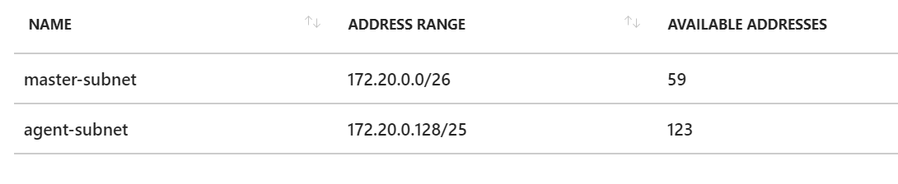

# Scenario: Deploy ACS Kuberbetes using acs-engine in existing VNET


Assuming that we've an existing VNET like this:


Let's create an new ACS Kubernetes cluster using 2 subnets in the existing VNET:
- **master-subnet** for the master node(s)
- **agent-subnet** for the agent nodes

Sample:




## Pre-requisites

Summary:
- Step 1: Install acs-engine
- Step 2: Install Azure CLI 2.0
- Step 3: Generate an SSH Key
- Step 4: Create a Service Principal

If you are missing any of these pre-requisites, start [here](./prerequisites.md).


## Create Kubernetes cluster with acs-engine

Summary:
- Step 1: Create your Cluster Definition with custom VNET
- Step 2: Generate ARM template
- Step 3: Deploy ARM template
- Step 4: Install the kubectl CLI
- Step 5: Connect with kubectl

Follow these steps to create your Kubernetes [cluster](./create-k8s-cluster.md).


## Deploy an application to test it

Summary:
- Step 1: Create the Kubernetes manifest file
- Step 2: Deploy and run the application
- Step 3: Test the application

Follow these steps to test an [application](./test-application.md).


## Useful commands

```shell
kubectl cluster-info
kubectl get nodes
kubectl get pods
kubectl get services
```

Run Kubernetes dashboard

```shell
kubectl proxy
```

Output:

```shell
Starting to serve on 127.0.0.1:8001
```

Just navigate to http://localhost:8001


