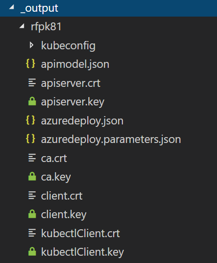

## Create Kubernetes cluster with acs-engine

Summary:
- Step 1: Create your Cluster Definition with custom VNET
- Step 2: Generate ARM template
- Step 3: Deploy ARM template
- Step 4: Install the kubectl CLI
- Step 5: Connect with kubectl

Let's start.

### Step 1: Create your Cluster Definition with custom VNET

There are several templates available [here](https://github.com/Azure/acs-engine/blob/master/examples/) to accelerate this.

And locally also:
- Simple template [kubernetes.json](./cluster-profiles/kubernetes.json)
- Custom VNET template [k8s-custom-vnet.json](./cluster-profiles/k8s-custom-vnet.json)

Since we need a custom VNET, let's start by copying the template from [k8s-custom-vnet.json](./cluster-profiles/k8s-custom-vnet.json) to our new profile `k8s-my-profile.json`


Now let's edit our file `k8s-my-profile.json` and fill out the required values:

- `dnsPrefix`: must be a region-unique name and will form part of the hostname (e.g. myprod1, staging, leapingllama) - be unique!
- `keyData`: must contain the public portion of an SSH key - this will be associated with the `adminUsername` value found in the same section of the cluster definition (e.g. 'ssh-rsa AAAAB3NzaC1yc2EAAAADAQABA....'). You can get it with:

```shell
cat ~/.ssh/id_rsa.pub
```

- `clientId`: this is the service principal's appId uuid or name
- `secret`: this is the service principal's password or randomly-generated password
- Additionally you can customize the *number* and *type* of the VMs used for master and agent nodes.

To customize the VNET settings, edit these values in the `masterProfile`:

- `vnetSubnetId` with your subnet Id for the master nodes.
- `vnetCidr` with the CIDR block that represents the usable address space in the existing VNET.
- `firstConsecutiveStaticIP` with the first IP address to use for IP static IP allocation.

To customize the VNET settings, edit these values in each of the `agentPoolProfiles`:

- `vnetSubnetId` with your subnet Id for the agent nodes.


My example:


- **VNET**: /subscriptions/5dd549af-d55f-4c2c-ba14-8bd7699a59b3/resourceGroups/acs-kubernetes-rg/providers/Microsoft.Network/virtualNetworks/acskub-vnet

- **Master nodes subnet**: /subscriptions/5dd549af-d55f-4c2c-ba14-8bd7699a59b3/resourceGroups/acs-kubernetes-rg/providers/Microsoft.Network/virtualNetworks/acskub-vnet/subnets/master-subnet

- **Agent nodes subnet**: /subscriptions/5dd549af-d55f-4c2c-ba14-8bd7699a59b3/resourceGroups/acs-kubernetes-rg/providers/Microsoft.Network/virtualNetworks/acskub-vnet/subnets/agent-subnet

```json
...
      "masterProfile": {
        "count": 1,
        "dnsPrefix": "rfpk81",
        "vmSize": "Standard_D2_v2",
        "vnetSubnetId": "/subscriptions/5dd549af-d55f-4c2c-ba14-8bd7699a59b3/resourceGroups/acs-kubernetes-rg/providers/Microsoft.Network/virtualNetworks/acskub-vnet/subnets/master-subnet",
        "firstConsecutiveStaticIP": "172.20.0.4",
        "vnetCidr": "172.20.0.0/24"
      },
      "agentPoolProfiles": [
        {
          "name": "agentpool1",
          "count": 2,
          "vmSize": "Standard_D2_v2",
          "availabilityProfile": "AvailabilitySet",
          "vnetSubnetId": "/subscriptions/5dd549af-d55f-4c2c-ba14-8bd7699a59b3/resourceGroups/acs-kubernetes-rg/providers/Microsoft.Network/virtualNetworks/acskub-vnet/subnets/agent-subnet"
        }
      ],        
...
```

### Step 2: Generate ARM template

```shell
acs-engine generate k8s-my-profile.json
```

This will generate an `_output` directory with all the artifacts:




### Step 3: Deploy ARM template

```shell
$ az login

$ az account set --subscription "<SUBSCRIPTION NAME OR ID>"

$ az group create \
    --name "<RESOURCE_GROUP_NAME>" \
    --location "<LOCATION>"

$ az group deployment create \
    --name "<DEPLOYMENT NAME>" \
    --resource-group "<RESOURCE_GROUP_NAME>" \
    --template-file "./_output/<INSTANCE>/azuredeploy.json" \
    --parameters "./_output/<INSTANCE>/azuredeploy.parameters.json"
```

My example:


```shell
$ az login

$ az account set --subscription "5dd549af-d55f-4c2c-ba14-8bd7699a59b3"

$ az group create \
    --name "acs-k8s-rg" \
    --location "northeurope"

$ az group deployment create \
    --name "rfpk8s01" \
    --resource-group "acs-k8s-rg" \
    --template-file "./_output/rfpk81/azuredeploy.json" \
    --parameters "./_output/rfpk81/azuredeploy.parameters.json"
```


**Notes**

- `/28` is not enough for master nor agent pools subnets
- 31 IP addresses are used for each master VM (`/26` is ok for 1 master)
- 31 IP addresses are used for each agent VM (`/25` is ok for 2 agents)


### Step 4: Install the kubectl CLI

To connect to the Kubernetes cluster from your client computer, use kubectl, the Kubernetes command-line client.

If you're using Azure CloudShell, kubectl is already installed. If you want to install it locally, use this:

```shell
az acs kubernetes install-cli
```

If running in Linux or macOS, you may need to run with sudo. On Windows, ensure your shell has been run as administrator.

You can test it in the end with:

```shell
kubectl version
```

### Step 5: Connect with kubectl

For `kubectl` to connect to your Kubernetes cluster you need the `kubeconfig` file.

acs-engine generates `kubeconfig` files for each possible region. Access the new cluster by using the `kubeconfig` generated for the cluster's location. This example used `northeurope`, so the `kubeconfig` is `_output/<clustername>/kubeconfig/kubeconfig.northeurope.json`

To use this kubeconfig file by default, just do this:

```shell
mkdir ~/.kube
cp /home/rfp/dev/containers/new/_output/rfpk81/kubeconfig/kubeconfig.northeurope.json ~/.kube/config
```

Now if you try this command:

```shell
kubectl cluster-info
```

You will get this output:

```shell
Kubernetes master is running at https://rfpk81.northeurope.cloudapp.azure.com
Heapster is running at https://rfpk81.northeurope.cloudapp.azure.com/api/v1/namespaces/kube-system/services/heapster/proxy
KubeDNS is running at https://rfpk81.northeurope.cloudapp.azure.com/api/v1/namespaces/kube-system/services/kube-dns:dns/proxy
kubernetes-dashboard is running at https://rfpk81.northeurope.cloudapp.azure.com/api/v1/namespaces/kube-system/services/kubernetes-dashboard/proxy
tiller-deploy is running at https://rfpk81.northeurope.cloudapp.azure.com/api/v1/namespaces/kube-system/services/tiller-deploy:tiller/proxy

To further debug and diagnose cluster problems, use 'kubectl cluster-info dump'.
```
