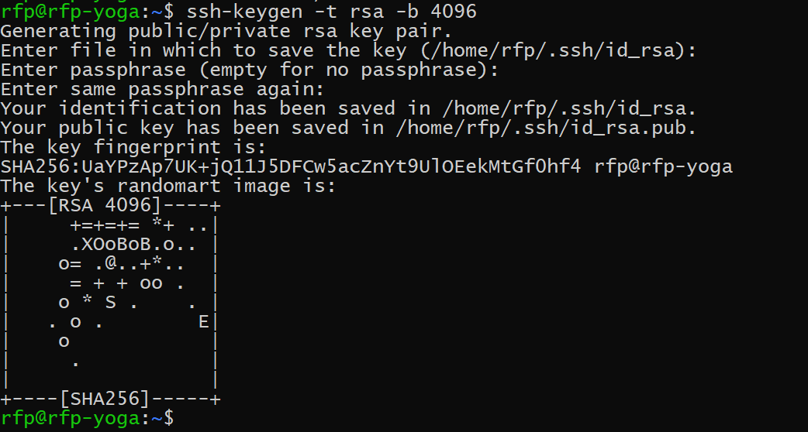

### Step 1: Generate an SSH Key

In addition to using Kubernetes APIs to interact with the clusters, cluster operators may access the master and agent machines using SSH.

To create your public and private SSH keys on the command-line:

```shell
mkdir ~/.ssh
chmod 700 ~/.ssh
ssh-keygen -t rsa -b 4096
```

You will be prompted for a location to save the keys, and a passphrase for the keys.



Your public key is now available by default as .ssh/id_rsa.pub in your home folder (or in the location and file that you specified).

Congratulations! You now have a set of keys.
