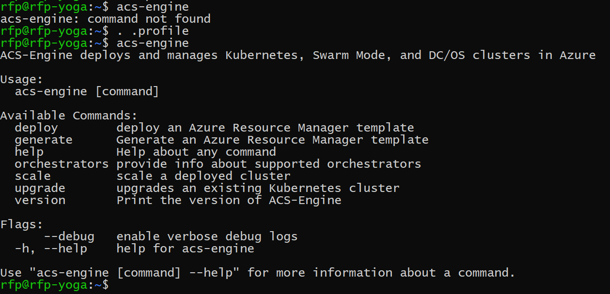

## Setup acs-engine

```shell
mkdir acs-engine
cd acs_engine

wget https://github.com/Azure/acs-engine/releases/download/v0.12.0/acs-engine-v0.12.0-linux-amd64.tar.gz

tar xvzf acs-engine-v0.12.0-linux-amd64.tar.gz

cd acs-engine-v0.12.0-linux-amd64
mv * ..
cd ..
rm -rf acs-engine-v0.12.0-linux-amd64*
```

In the end you will have this:


Just add it to your path by adding this line in the end of your `.profile` file:

```
PATH="/home/rfp/dev/acs-engine:$PATH"
```

Execute `.profile` to reflect the changes:

```shell
 . .profile
```

Test it:


