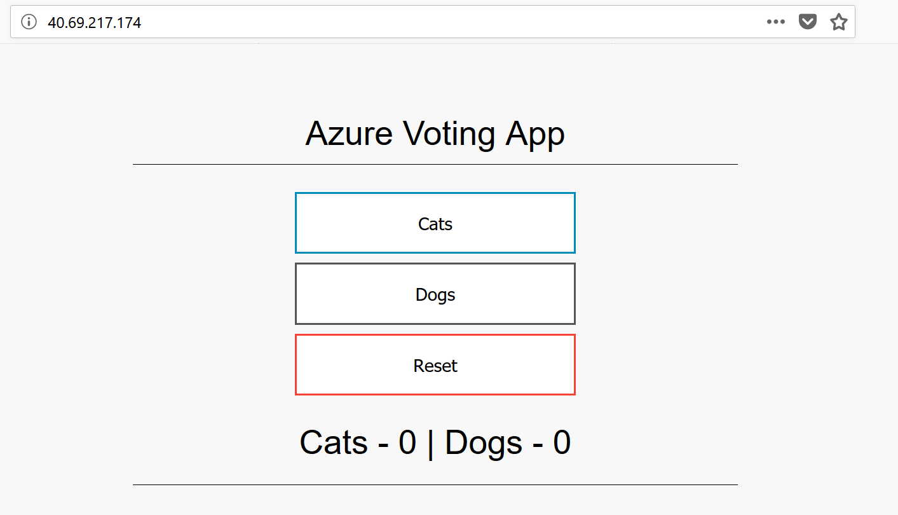

## Run the application

Summary:
- Step 1: Create the Kubernetes manifest file
- Step 2: Deploy and run the application
- Step 3: Test the application

Let's start.


### Step 1: Create the Kubernetes manifest file

A Kubernetes manifest file defines a desired state for the cluster, including what container images should be running. For this example, a manifest is used to create all objects needed to run the Azure Vote application.

Just use the sample `azure-vote.yaml`.


### Step 2: Deploy and run the application

Use the kubectl create command to run the application.

```shell
kubectl create -f azure-vote.yaml
```

This should be the output:

```shell
deployment "azure-vote-back" created
service "azure-vote-back" created
deployment "azure-vote-front" created
service "azure-vote-front" created
```

### Step 3: Test the application

As the application is run, a Kubernetes service is created that exposes the application front end to the internet. This process can take a few minutes to complete.

To monitor progress, use the kubectl get service command with the --watch argument.

```shell
kubectl get service azure-vote-front --watch
```

Initially the EXTERNAL-IP for the azure-vote-front service appears as pending.

```shell
NAME               TYPE           CLUSTER-IP   EXTERNAL-IP   PORT(S)        AGE
azure-vote-front   LoadBalancer   10.0.37.27   <pending>     80:30572/TCP   6s
```

Once the EXTERNAL-IP address has changed from pending to an IP address, use CTRL-C to stop the kubectl watch process.


```shell
azure-vote-front   LoadBalancer   10.0.37.27   40.69.217.174   80:30572/TCP   2m
```

You can now browse to the external IP address to see the Azure Vote App.


